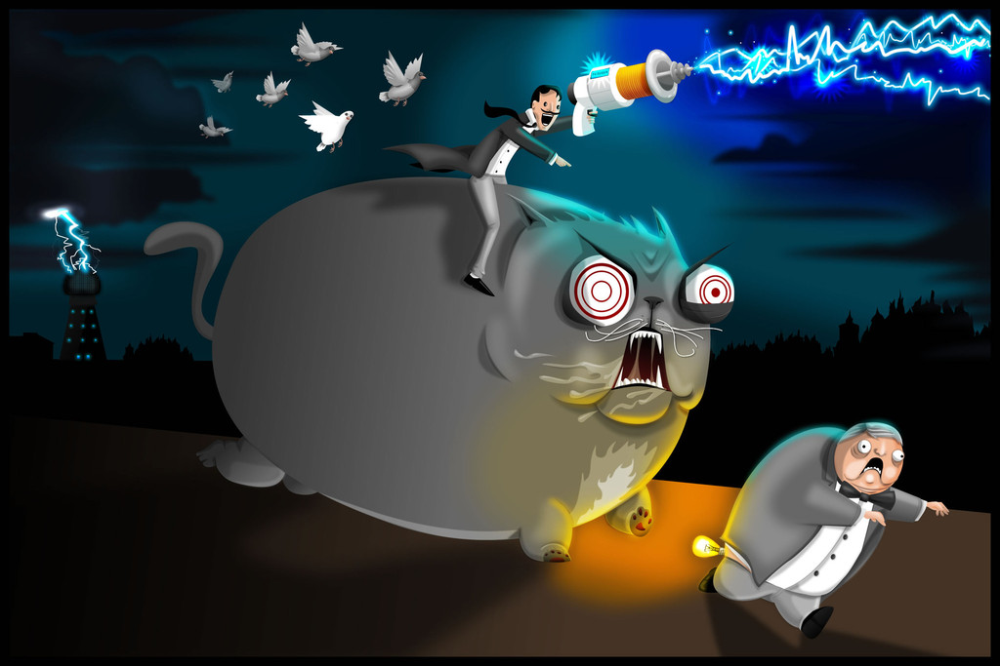
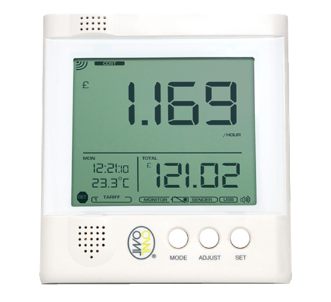

# Tesla

This is a very little project to grab the data from on OWL-CM160 and generate RRD graph.
The way the OWL device communicates and the reverse engineering of the USB frame came from [Philippe Cornet's Eagle-Owl](https://github.com/cornetp/eagle-owl) project.
A lot of Eagle-Owl code has been removed/changed but all the meaning part are from the original project.
I did this fork since my need are really simple, I only wanted to generate RRD graph, no need for sqlite nor javascript.

The graph are generated per:

- Hours
- Day
- Week
- Months
- Year

# OWL-CM160

This little guy here will measure the current passing through a wire with an amperometric clamp.
It is not the most precise method in the world, but it'll do the job for many of us that rent a place and can't change easily the circuit breaker.

With this device, and a little software, you can track your electrical consumption which let you find out some habits of yours or if you have a device that sucks way more that it should (an old frigdge, a lamp, ...).

# Requirements

You should have librrd4, libusb and cmake installed on your system.

This should do the trick for a Debian/Ubuntu distribution:

    $ sudo apt-get install librrd4 libusb-dev cmake

# Install

Pretty standard:

    $ mkdir -p build; cd build
    $ cmake .. && make
    $ sudo make install

# Start

You need to change the default path in the init script (the tesla file at the root of this repo).
This path is were the graph will be generated.

To install the init script, you only need to do:

    $ sudo cp tesla /etc/init.d/tesla
    $ sudo update-rc.d tesla defaults
    $ sudo /etc/init.d/tesla start

That's it.
As soon as you plug the device in your machine, it will read the data and start generating graphs every 10mn.
